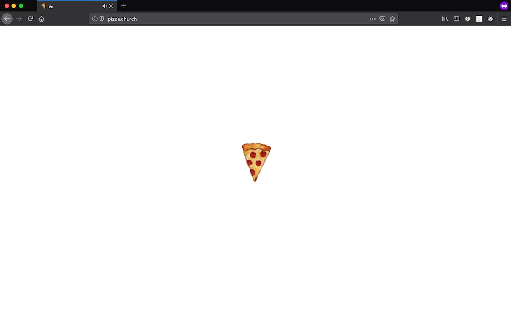

<section class="blog-section">

It's a spinning pizza emoji with Gregorian chanting in the background.

  <hidden>
    
    
  </hidden>
  <zoom-image src='pizza-church.jpg' zoomSrc='pizza-church-zoom.jpg' alt='pizza.church'></zoom-image>

</section>
