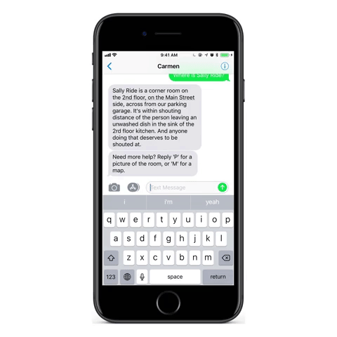
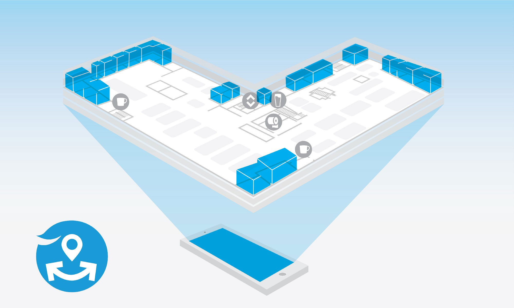

Finding a meeting room at the 4-story <a href="https://en.wikipedia.org/wiki/TWA_Corporate_Headquarters_Building" target="_blank">TWA Headquarters</a> building <a href="https://www.barkleyus.com/" target="_blank">Barkley</a> calls home is notoriously frustrating. There's a vague naming scheme: celestial bodies (Big Dipper, Galaxy) on 1, people (Neil Armstrong, Ellen Ochoa) on 2, planets (Mercury, Neptune) on 3, and everything else (Flight Deck, Magenta Lounge) on 4. But even if you're on the right floor, it's pretty much guess and check from there. Not to mention the few rooms that have inexplicably moved locations on the same floor. (🤷‍♂️)

One of the main functions of <a href="http://moonshot.barkleyus.com" target="_blank">Moonshot</a>, the innovation lab at Barkley, is to improve processes of all kinds (thinking, working, doing) within the building. As a part of an exploration into conversational interfaces (see this <a href="https://medium.com/moonshotlab/revisiting-our-first-technology-ac8a10c63670" target="_blank">article</a> by <a href="https://twitter.com/mlogan" target="_blank">Mark Logan</a> for more info), we decided to try and tackle this problem head-on. Enter Carmen, a chatbot!

(Hold your groans, please.)

  <hidden>
    
  </hidden>
  <zoom-image src='animation.gif' alt='Carmen Map'></zoom-image>

Carmen can provide directions to any building in the room, as well as send maps and detailed pictures. Because Carmen is built with <a href="https://botkit.ai/" target="_blank">botkit</a>, it could feasibly be extended to other platforms like Slack and Facebook Messenger, but interaction is currently limited to SMS via <a href="https://www.twilio.com/" target="_blank">Twilio</a>. You simply text Carmen's number a question like "Where's Sally Ride?" (or, if you're in a hurry, you can omit the niceties: "Sally Ride"), and Carmen promptly responds: "Sally Ride is a corner room on the 2nd floor, on the Main Street side, across from our parking garage. It's within shouting distance of the person leaving an unwashed dish in the sink of the 2nd floor kitchen. And anyone doing that deserves to be shouted at."

  <hidden>
    
    
  </hidden>
  <zoom-image src='map.jpg' zoomSrc='map-zoom.jpg' alt='Carmen Map'></zoom-image>

Though Carmen isn't able to hold a conversation about anything other than the location of rooms, it has proven to be an indispensable tool for getting around in the time since going live. In fact, in just under 3 months since launch, Carmen has sent 1364 messages to 132 unique Barkley partners (over 50% of the office in Kansas City). I keep a track of any inputs Carmen doesn't understand, as well as which rooms are most often requested, which may inform future iterations of the bot or even wayfinding around the building.

I for one welcome our new (helpful, utilitarian) chatbot overlords.
