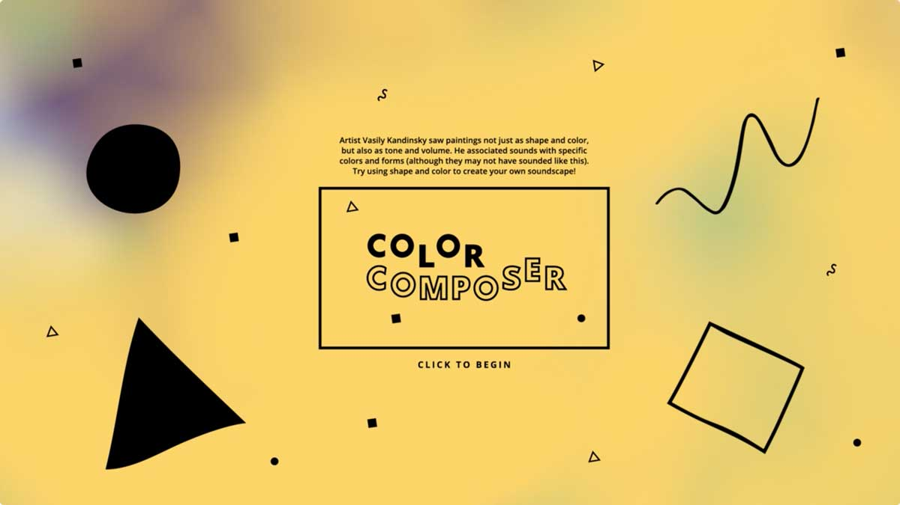
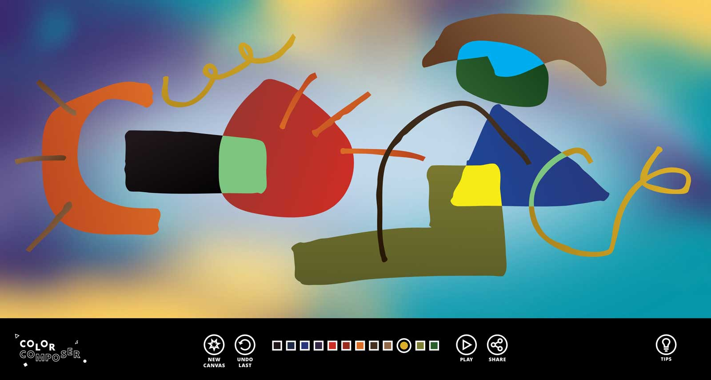
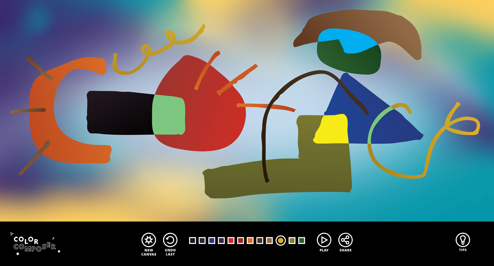

In June 2015, the <a href="https://nelson-atkins.org/" target="_blank">Nelson-Atkins Museum of Art</a> in Kansas City received a significant donation of 29 works of Impressionist and Post-Impressionist painting (including works by Cézanne, Degas, Gauguin, Monet, van Gogh, and <a href="https://nelson-atkins.org/the-bloch-galleries/" target="_blank">others</a>) from the private collection of the Bloch family, of H&R Block fame. The donation was so significant that the museum decided to completely renovate and open  the all-new The Bloch Galleries to showcase the incredible donation.

As a part of this renovation, the museum decided to include several interactive experiences that would teach about the works in the collection, as well as to integrate an innovative <a href="https://www.detour.com/" target="_blank">Detour</a> audio tour (the second of its kind, following SFMOMA). The interactives would be showcased on a handful of iPads spread throughout the space, tethered to viewing benches, as well as two 32" touchscreen tables with an individual experience on each. The Nelson-Atkins came to Moonshot, the innovation lab at <a href="https://www.barkleyus.com/" target="_blank">Barkley</a>, for help in designing and developing the experiences that would be showcased in the gallery alongside the artwork. We were honored to oblige.

  <hidden>
    
    
  </hidden>
  <zoom-image src='static.jpg' zoomSrc='static-zoom.jpg' alt='Video Screenshot'></zoom-image>

I had the privilege of developing Color Composer, an interactive experience inspired by the works of Wassily Kandinsky. The experience is showcased on a 32" touchscreen table and seeks to recreate the inextricable connection between sound and color experienced by Kandinsky, who was reportedly a <a href="https://en.wikipedia.org/wiki/Synesthesia" target="_blank">synesthete</a>. A user would step up to the table and be presented with a blank canvas and a color picker. Each shape added to the canvas would be recognized (circle, square, triangle, line, other), and in combination with its color and size would produce a sound. The user could, once they were content with their composition, press a button and hear it played in its entirety: an invisible stylus would scan across, left to right, playing each sound sequentially. The user could then adjust their composition by using two fingers to adjust the size or position of any shape. Then, the composition could be exported as a video file and a link to the unique composition could be texted to a user's phone.

  <hidden>
    
    
  </hidden>
  <zoom-image src='canvas.jpg' zoomSrc='canvas-zoom.jpg' alt='Canvas'></zoom-image>

This project was probably one of the most daunting ones I've ever faced. There were so many different pieces that needed to seamlessly blend together: multitouch interaction, editing the canvas, playing sounds, recording the canvas, putting in all the safeguards necessary for any sort of installation work (ignoring extraneous inputs, going to sleep, resetting work from previous users, logging errors, failing gracefully, autostarting, etc.), and more. On top of this, it was important to the museum that any installation available in gallery would also have a companion experience on the web, so that people who are unable to physically visit the gallery would still have the opportunity to experience the interactive. That meant building the experience for the browser (and making sure it plays well with a variety of browsers users could potentially use), which also increases the overhead significantly.

For those curious, here are a few of the libraries I used:
  * <a href="http://paperjs.org/" target="_blank">paper.js</a> for drawing shapes
  * <a href="https://hammerjs.github.io/" target="_blank">hammer.js</a> for multitouch interactions
  * <a href="https://howlerjs.com/" target="_blank">howler.js</a> for playing sounds
  * <a href="https://www.ffmpeg.org/" target="_blank">ffmpeg</a> on the server to combine the sound produced by the canvas (via <a href="https://github.com/mattdiamond/Recorderjs" target="_blank">recorder.js</a>) with the screen recording (via <a href="https://github.com/muaz-khan/RecordRTC/" target="_blank">recordRTC</a>)
  * <a href="https://www.mailgun.com/" target="_blank">Mailgun</a> for email
  * <a href="https://www.twilio.com/sms/" target="_blank">Twilio</a> for SMS

Despite being an incredibly challenging project, this is one that I had the most fun building and am most proud of having worked on. The gallery opened in March 2017 and this experience has been running daily since then.

